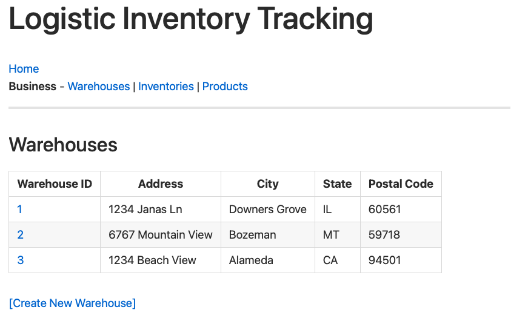
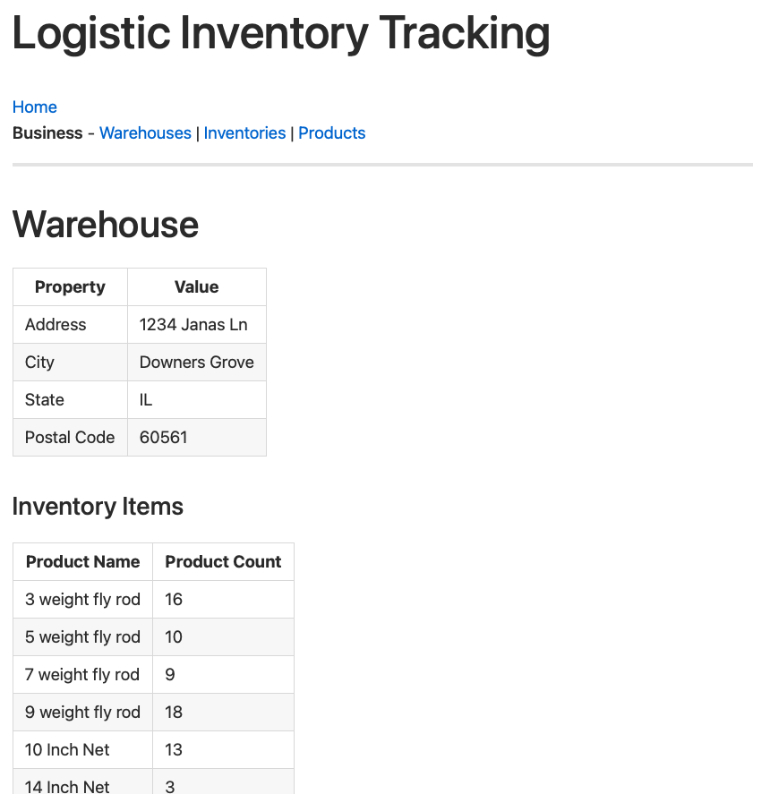
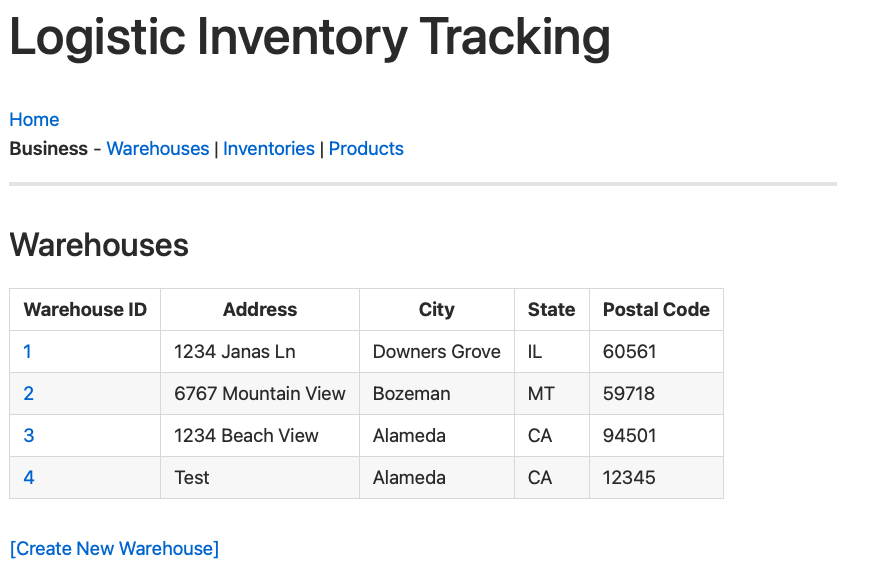
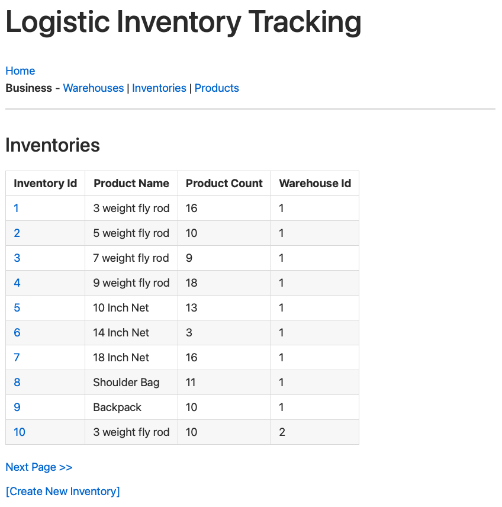
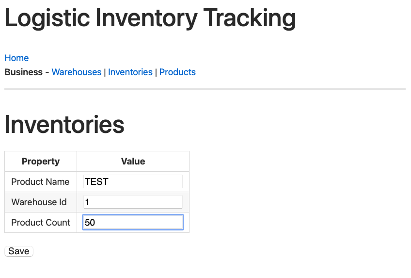
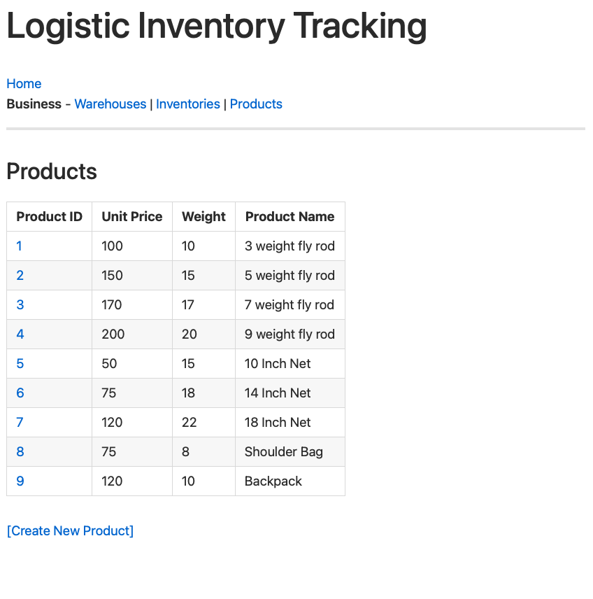
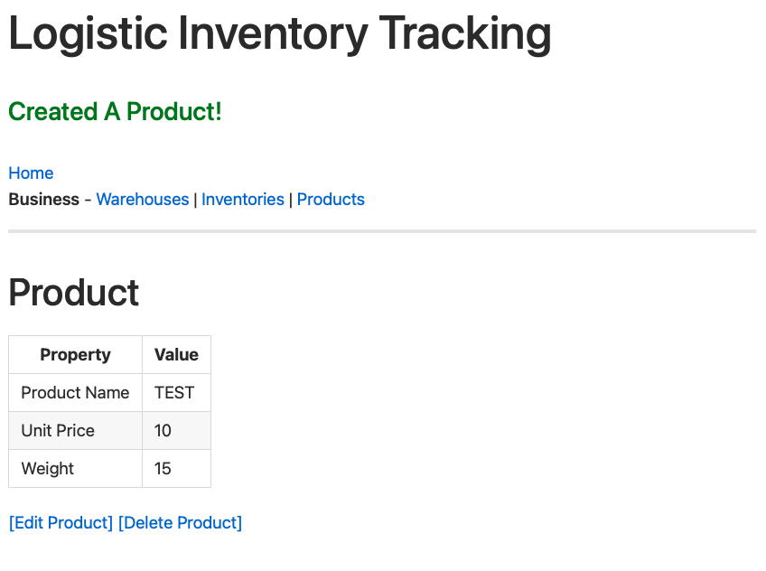
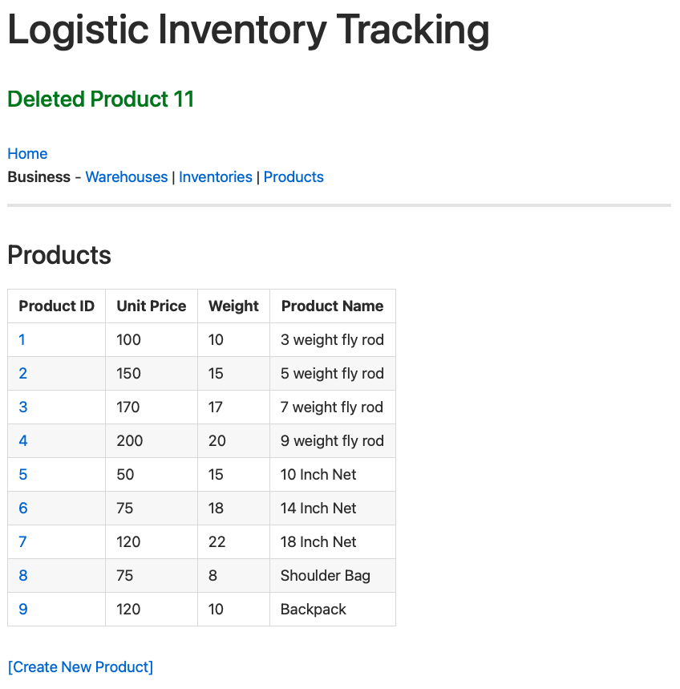

# Fall 2022 - Shopify
Developer Intern Challenge Question
link to repl https://replit.com/@PatrickOConnor3/ShopifyApplication-2?v=1
Please view below for images if db is not connecting on replit still. Thank you

## Step 1. 
### TASK: Build an inventory tracking web application for a logistics company. We are looking for a web application that meets the requirements listed below, along with one additional feature, with the options also listed below.

You can tackle this challenge using any technology you want. This is an open-ended task, but we want to focus on high quality back-end code. Custom UIs and interactive frameworks like React are not necessary. Ideally, the web application can run within 15 minutes.

Please provide instructions on how to use your application. The application should be shared as a public Github repo that contains all the necessary configuration to be runnable from Replit without any additional setup.

Information: You can use frameworks, libraries and external dependencies to help you get to the parts you are interested in building, if this helps you; or start from scratch. When building, consider how more features could be added in the future.

Please focus on what interests you the most. If you need inspiration, here are examples of what you can work on.

### Requirements:

- Basic CRUD Functionality. You should be able to:
- Create inventory items
- Edit Them
- Delete Them
- View a list of them

### ONLY ONE OF THE FOLLOWING (We will only evaluate the first feature chosen, so please only choose one)

- When deleting, allow deletion comments and undeletion
- Ability to create warehouses/locations and assign inventory to specific locations
- Ability to create “shipments” and assign inventory to the shipment, and adjust inventory appropriately

Authentication and CSS/Design are not required and will not be considered during evaluation.

## Step 2: 
### Run the app on Replit. Now that you have built your code in GitHub, you will import the project to replit where you will run the application

- Create a Replit account and follow the instructions (you can use the YouTube video) on how to get started
- Once you have created your account, link your GitHub challenge link to your Riplit account

*Submit your github link for the code in your application
*Submit your Replit link for deploying in your application

## A couple of images from the website running locally
<h4>Warehouses</h4>

<h4>Inventories</h4>

<h4>Products</h4>

### Project Resources

* [Spark Java Docs](http://sparkjava.com/documentation)
* [Velocity Templates Docs](https://velocity.apache.org/engine/2.2/user-guide.html#loops)
* [Active JDBC Docs](https://javalite.io/activejdbc)
